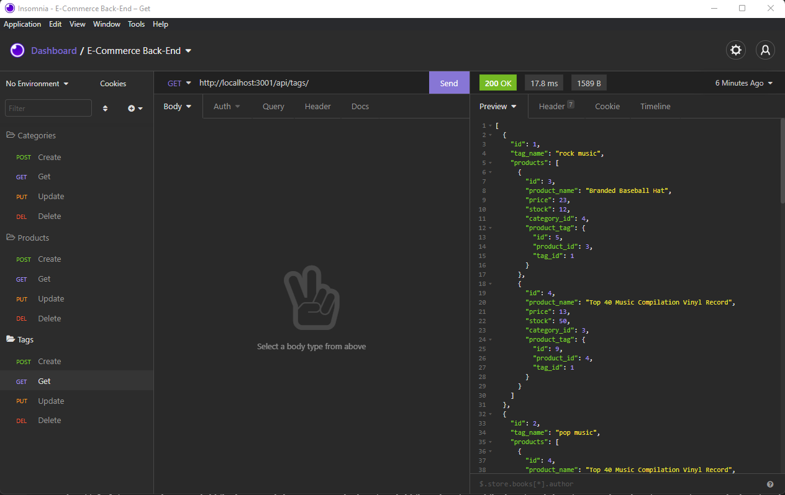

# 13-hw-e-commerce
E-Commerce Back End

## User Story

```md
AS A manager at an internet retail company
I WANT a back end for my e-commerce website that uses the latest technologies
SO THAT my company can compete with other e-commerce companies
```

## Acceptance Criteria

```md
GIVEN a functional Express.js API
WHEN I add my database name, MySQL username, and MySQL password to an environment variable file
THEN I am able to connect to a database using Sequelize
WHEN I enter schema and seed commands
THEN a development database is created and is seeded with test data
WHEN I enter the command to invoke the application
THEN my server is started and the Sequelize models are synced to the MySQL database
WHEN I open API GET routes in Insomnia Core for categories, products, or tags
THEN the data for each of these routes is displayed in a formatted JSON
WHEN I test API POST, PUT, and DELETE routes in Insomnia Core
THEN I am able to successfully create, update, and delete data in my database
```

## Installation

Clone Repositiory

Update .env file with your credentials and remove .EXAMPLE 

```
npm install
```

Create your database

```
mysql -u root -p
``` 

```
SOURCE db/schema.sql;
```

Check if Database has been suuccessfuly created

```
SHOW DATABASES;
```

Exit from mySql2


Populate the Databases

```
npm run seed
```

Enter the following to run the application and start the server:

```
npm start
```

## Demo



## Links

### Repo

https://github.com/CPetrevski/13-hw-e-commerce

### Visual Demo

https://watch.screencastify.com/v/RdZzO4Im2T9SSPapbpN5